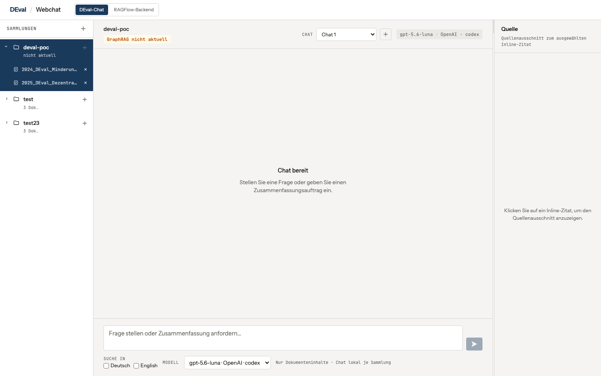
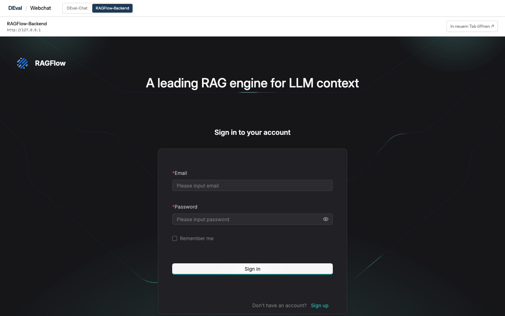

# DEval – RAGFlow PDF-Provenance-PoC

DEval ist eine schlanke Weboberfläche vor RAGFlow. Sie macht die in RAGFlow verwalteten Wissensdatenbanken im Browser per RAG chatbar und ergänzt Uploads, Verarbeitungsstatus, GraphRAG und deterministische PDF-Quellen. PyMuPDF extrahiert die Dokumente lokal, SQLite speichert die Provenienz und RAGFlow übernimmt Parsing, Retrieval, GraphRAG und Antwortgenerierung.

Die LLM-Inferenz läuft in diesem Setup **nicht lokal über Ollama**, sondern über einen in RAGFlow konfigurierten externen/OpenAI-kompatiblen Provider. Nur die Embeddings laufen standardmäßig lokal im offiziellen RAGFlow-TEI-Container.

## Das zentrale Prinzip: Chats bleiben im Browser

DEval speichert Chatverläufe nicht serverseitig. Jeder Chat, das ausgewählte Modell und die Nachrichten werden ausschließlich im Browser gespeichert. Für eine neue Antwort übergibt der Browser den bisherigen Verlauf jeweils vollständig an das DEval-Backend; DEval leitet ihn stateless an RAGFlow weiter, ohne eine RAGFlow-Session oder Chat-Historie anzulegen.

RAGFlow benötigt für seinen OpenAI-kompatiblen Endpunkt weiterhin ein technisches Chat-Assistant-Objekt. Dieses enthält nur die Verknüpfung von Wissensdatenbank, Modell und Prompt – nicht den Gesprächsverlauf. Die eigentlichen lokalen Chats bleiben im Browser und können dort getrennt verwaltet werden.

## Screenshots

| DEval-Webchat | Eingebettete RAGFlow-Weboberfläche |
| --- | --- |
|  |  |

## Schnellstart

### Voraussetzungen

- Docker Desktop mit Docker Compose (mindestens Compose 2.26.1)
- Python 3.9–3.12
- Node.js und `pnpm`
- macOS/ARM: Docker muss `linux/amd64` emulieren können
- Für RAGFlow mindestens ca. 4 CPUs, 16 GB RAM und 50 GB freien Speicher
- Auf Linux: `vm.max_map_count >= 262144` für Elasticsearch

Der offizielle RAGFlow-Stack ist ressourcenintensiv. Für einen ersten Start sollten keine weiteren großen Docker-Stacks laufen.

### 1. Python-Umgebung und DEval-Konfiguration

Im Repository-Root:

```bash
python3 -m venv .venv
. .venv/bin/activate
python -m pip install -e '.[test]'
cp .env.example .env
```

Danach `.env` bearbeiten. Die wichtigsten Variablen sind:

```dotenv
# RAGFlow API, ohne /api/v1 – diesen Präfix ergänzt DEval selbst.
RAGFLOW_BASE_URL=http://127.0.0.1:9380

# Separater RAGFlow-API-Key, nicht der Key des externen LLM-Providers.
RAGFLOW_API_KEY=<RAGFLOW_API_KEY>

# Lokaler Scope der CLI und der Provenienz-Registry.
RAGFLOW_DATASET_NAME=deval-poc

# Embeddings: offizieller TEI-CPU-Service aus dem Docker-Stack.
RAGFLOW_EMBEDDING_MODEL=BAAI/bge-small-en-v1.5@Builtin

# Externes Chat-/GraphRAG-Modell. Der Wert muss exakt zu einem
# konfigurierten Chatmodell in RAGFlow passen.
RAGFLOW_LLM_MODEL=gpt-5.6-luna@codex@OpenAI
```

`RAGFLOW_API_KEY` wird in RAGFlow erzeugt. Niemals einen externen OpenAI-/Anthropic-Key in Git, in die Frontend-Konfiguration oder in den Browser eintragen.

Die übrigen Variablen stehen vollständig in [`.env.example`](.env.example). Die wichtigsten optionalen Werte sind:

| Variable | Zweck | Standard |
| --- | --- | --- |
| `RAGFLOW_CHUNK_METHOD` | RAGFlow-Parser | `naive` |
| `RAGFLOW_CHUNK_TOKEN_NUM` | Zielgröße der Chunks | `512` |
| `RAGFLOW_REGISTRY_PATH` | lokale SQLite-Provenienz | `.data/registry.sqlite3` |
| `RAGFLOW_REQUEST_TIMEOUT` | HTTP-Timeout | `30` Sekunden |
| `RAGFLOW_PARSE_TIMEOUT` | Parsing-Timeout | `1800` Sekunden |
| `RAGFLOW_GRAPH_TIMEOUT` | GraphRAG-Timeout | `1800` Sekunden |
| `RAGFLOW_CITATION_THRESHOLD` | Mindestscore für Text-Matching | `0.60` |
| `DEVAL_RAGFLOW_STATELESS_CHAT` | RAGFlow-Sessions/Verlauf deaktivieren | `true` |
| `RUN_LIVE_RAGFLOW_TESTS` | Live-Tests explizit aktivieren | `false` |

### 2. Offizielle RAGFlow-Container starten

Die Compose-Dateien werden von `scripts/ragflow-compose.sh` aus dem offiziellen RAGFlow-Repository gestaged. Die erzeugte Docker-`.env` liegt unter `.data/` und bleibt aus Git ausgeschlossen.

```bash
./scripts/ragflow-compose.sh verify
./scripts/ragflow-compose.sh up
./scripts/ragflow-compose.sh wait
./scripts/ragflow-compose.sh ps
```

`wait` wartet auf den echten RAGFlow-Readiness-Endpunkt und kann beim ersten Start mehrere Minuten dauern. Die normalen Lifecycle-Befehle sind:

```bash
./scripts/ragflow-compose.sh ps
./scripts/ragflow-compose.sh logs ragflow-cpu
./scripts/ragflow-compose.sh down
```

`down` entfernt **keine** persistenten Volumes. Niemals `docker compose down -v` verwenden, wenn die vorhandenen Dokumente und RAGFlow-Daten erhalten bleiben sollen.

### 3. Externes LLM in RAGFlow konfigurieren

Ollama ist für diesen Ablauf nicht erforderlich und wird nicht gestartet.

1. RAGFlow im Browser öffnen: <http://127.0.0.1>
2. Einloggen und **Settings → Model providers** öffnen.
3. Einen externen Provider konfigurieren, zum Beispiel **OpenAI**:
   - Instanzname: `codex`
   - Base URL: `https://api.openai.com/v1` oder die URL des eigenen OpenAI-kompatiblen Gateways
   - API-Key: der Key des externen LLM-Providers
   - Chatmodelle: die tatsächlich verfügbaren Modell-IDs, z. B. `gpt-5.6-luna`, `gpt-5.6-sol`, `gpt-5.6-terra`
4. Für jedes Modell den Typ **Chat** aktivieren und die Provider-Konfiguration testen.
5. Unter **Avatar → API** einen RAGFlow-API-Key erzeugen und als `RAGFLOW_API_KEY` in der Root-`.env` eintragen.
6. `RAGFLOW_LLM_MODEL` auf den exakten von RAGFlow gelieferten Modellwert setzen. Dieser Wert wird für CLI und GraphRAG verwendet. Für den Webchat ist keine separate Modellliste nötig: DEval zeigt automatisch alle Chatmodelle an, die der aktuelle RAGFlow-Tenant über `GET /api/v1/models?type=chat` bereitstellt.

Der Modellwert ist eine RAGFlow-Referenz auf **Modell, Provider-Instanz und Factory**. Wenn das Gateway einen anderen Instanznamen oder eine andere Factory verwendet, wird das Modell automatisch mit der aktuellen RAGFlow-Konfiguration übernommen. `RAGFLOW_API_KEY` und der externe Provider-Key sind zwei verschiedene Zugangsdaten.

Der TEI-Service für `BAAI/bge-small-en-v1.5` ist Teil des offiziellen Compose-Stacks und stellt nur Embeddings bereit. Er ersetzt keine Chat-/GraphRAG-Inferenz.

### 4. DEval-Backend starten

In einem zweiten Terminal, ebenfalls im Repository-Root:

```bash
. .venv/bin/activate
.venv/bin/deval-webchat --host 127.0.0.1 --port 8790
```

Das Backend spricht mit RAGFlow und stellt die lokale Web-API bereit. Es läuft absichtlich getrennt von RAGFlow.

### 5. Frontend starten und öffnen

In einem dritten Terminal:

```bash
cd frontend
pnpm install
DEVAL_API_URL=http://127.0.0.1:8790 pnpm dev --host 127.0.0.1
```

Danach im Browser öffnen:

<http://127.0.0.1:5173>

Falls `pnpm dev` wegen einer lokalen pnpm-Build-Freigabe mit `ERR_PNPM_IGNORED_BUILDS` abbricht, den Vite-Prozess direkt starten:

```bash
cd frontend
DEVAL_API_URL=http://127.0.0.1:8790 ./node_modules/.bin/vite --host 127.0.0.1
```

Die Vite-Variable `DEVAL_API_URL` ist wichtig, wenn das Backend auf Port `8790` läuft. Ohne sie verwendet der Vite-Proxy den Fallback-Port `8787`. Die Ansicht **RAGFlow-Backend** im oberen Umschalter bindet standardmäßig `http://127.0.0.1` ein; eine andere RAGFlow-Weboberfläche lässt sich über `VITE_RAGFLOW_WEB_URL` setzen.

## URLs und Ports

| Dienst | URL | Verwendung |
| --- | --- | --- |
| DEval-Frontend | <http://127.0.0.1:5173> | Browser-Oberfläche |
| DEval-Backend | <http://127.0.0.1:8790> | lokale API für das Frontend |
| RAGFlow-Weboberfläche | <http://127.0.0.1> | Login, Provider, Dataset-UI |
| RAGFlow-API | <http://127.0.0.1:9380> | Adapter und CLI |
| RAGFlow-Admin-Server | <http://127.0.0.1:9381> | Admin-/Health-Endpunkte, keine normale UI |

Schnelle Erreichbarkeitstests:

```bash
curl -i http://127.0.0.1:9380/api/v1/system/healthz
curl -i http://127.0.0.1:9381/api/v1/admin/ping
curl -i http://127.0.0.1:8790/api/health
```

## Deployment hinter Nginx

Für einen Server mit öffentlichem HTTPS sollten nur Nginx-Ports erreichbar sein. RAGFlow und das DEval-Backend bleiben an `127.0.0.1` gebunden. Der RAGFlow-Stack reserviert standardmäßig Host-Port `80`; wenn Nginx selbst Port `80` benötigt, die internen Webports beim Start verschieben:

```bash
export RAGFLOW_WEB_HTTP_PORT=127.0.0.1:8080
export RAGFLOW_WEB_HTTPS_PORT=127.0.0.1:8443
./scripts/ragflow-compose.sh verify
./scripts/ragflow-compose.sh up
./scripts/ragflow-compose.sh wait
```

Das Frontend wird für den Produktivbetrieb statisch gebaut. `DEVAL_API_URL` wird dabei nicht benötigt, weil Nginx `/api/` unter derselben Origin weiterleitet:

```bash
cd frontend
pnpm install
VITE_RAGFLOW_WEB_URL=https://ragflow.example.org pnpm build
```

Eine kopierbare Vorlage liegt unter [`deploy/nginx/deval-ragflow.conf.example`](deploy/nginx/deval-ragflow.conf.example). Sie enthält zwei Nginx-Virtual-Hosts (`deval.example.org` für DEval und `ragflow.example.org` für die eingebettete RAGFlow-Weboberfläche):

```nginx
server {
    listen 443 ssl;
    server_name deval.example.org;

    # ssl_certificate ...;
    # ssl_certificate_key ...;
    root /srv/deval/frontend/dist;
    index index.html;
    client_max_body_size 64m;

    location /api/ {
        # Kein abschließender Slash: /api/... bleibt beim Backend erhalten.
        proxy_pass http://127.0.0.1:8790;
        proxy_set_header Host $host;
        proxy_set_header X-Real-IP $remote_addr;
        proxy_set_header X-Forwarded-For $proxy_add_x_forwarded_for;
        proxy_set_header X-Forwarded-Proto $scheme;
        proxy_read_timeout 1800s;
    }

    location / {
        try_files $uri $uri/ /index.html;
    }
}

server {
    listen 443 ssl;
    server_name ragflow.example.org;

    # ssl_certificate ...;
    # ssl_certificate_key ...;
    location / {
        proxy_pass http://127.0.0.1:8080;
        proxy_http_version 1.1;
        proxy_set_header Upgrade $http_upgrade;
        proxy_set_header Connection "upgrade";
        proxy_set_header Host $host;
        proxy_set_header X-Forwarded-For $proxy_add_x_forwarded_for;
        proxy_set_header X-Forwarded-Proto $scheme;
        proxy_read_timeout 1800s;
    }
}
```

Danach das DEval-Backend auf `127.0.0.1:8790` starten und `https://deval.example.org` öffnen. Die Ports `8790`, `9380` und `9381` sollten nicht öffentlich exponiert werden. Für eine rein lokale Installation bleiben die oben dokumentierten Ports `5173`, `8790` und `9380` ausreichend.

## Verwendung des Webchats

1. Frontend unter <http://127.0.0.1:5173> öffnen.
2. Eine Sammlung anlegen oder auswählen.
3. Neben der Sammlung ein oder mehrere PDFs hochladen.
4. Warten, bis die Dokumente verarbeitet sind. Der Chat kann danach bereits mit den verarbeiteten Dokumenten verwendet werden; ein laufender GraphRAG-Aufbau läuft unabhängig im Hintergrund.
5. Ein konfiguriertes externes Chatmodell auswählen.
6. Eine Frage stellen. Die Quellen erscheinen neben den relevanten Aussagen.
7. Mit `+` im Chatkopf beliebig viele Chats je Sammlung im Browser anlegen und zwischen ihnen wechseln.
8. Dokumente können in der aufklappbaren Sammlung gelöscht werden. Danach wird GraphRAG erneut aktualisiert.
9. Eine ganze Sammlung lässt sich über das `×` neben ihrem Namen löschen. Dabei werden das RAGFlow-Dataset und die lokale Provenienz nach einer Bestätigung entfernt.
10. Unter **Suche in** lassen sich Deutsch und English für die sprachübergreifende RAGFlow-Suche je Browser-Chat an- oder abwählen.

Die Sammlung ist im linken Bereich als Ordner dargestellt. Dokumente bleiben dort sichtbar und auswählbar. Chatverläufe und Modellwahl bleiben je Sammlung/Chat ausschließlich im Browser. Der Dateiname im Quellenbereich öffnet das vollständige PDF in einem neuen Tab; die Seitenvorschau und Provenienz bleiben lokal.

## Was beim Upload und bei einer Frage passiert

```text
PDF im Browser
  -> DEval-Backend
  -> lokale PyMuPDF-Extraktion + SHA-256 + SQLite-Provenienz
  -> RAGFlow-Dataset und deterministisches Remote-Dokument
  -> RAGFlow-Parsing / Chunking
  -> GraphRAG-Aufbau nach erfolgreichem Parsing
  -> stateless Chatantwort über RAGFlows OpenAI-kompatiblen Endpoint
  -> separater Retrieval-Aufruf für deterministische Quellen
```

Wichtige Eigenschaften:

- `document_uid` ist der SHA-256-Hash der PDF-Bytes.
- Die lokale Registry liegt in `.data/registry.sqlite3` und enthält Provenienz, Seiten, Absätze, Bboxes und RAGFlow-Mappings.
- Uploads laufen asynchron; das Frontend fragt Job- und GraphRAG-Status regelmäßig ab.
- Malformed, verschlüsselte, leere und reine Scan-PDFs werden lokal registriert, aber nicht automatisch hochgeladen.
- Mixed-PDFs benötigen im CLI `--allow-mixed`; im Webchat wird die Verarbeitung entsprechend angezeigt.
- Zitate werden nicht vom LLM geraten: Die Chatantwort und die Quellenauflösung sind getrennt. `CitationResolver` ordnet RAGFlow-Referenzen deterministisch lokalen Seiten und Absätzen zu.
- Der Webchat prüft die GraphRAG-Bereitschaft. Standardmäßig erzeugt er keine RAGFlow-Session und sendet den lokalen Verlauf über `/api/v1/openai/{chat_id}/chat/completions`; `DEVAL_RAGFLOW_STATELESS_CHAT=false` schaltet testweise auf den alten Session-Flow zurück. Ein technisches RAGFlow-Chat-Assistant-Objekt kann dabei vorhanden sein, enthält aber keine Chat-Nachrichten.
- Die normale Quellenauflösung verwendet weiterhin einen separaten Retrieval-Aufruf ohne KG-Nutzung. Im CLI muss KG-Nutzung mit `query --use-kg` explizit angefordert werden.

## CLI

Alle CLI-Befehle werden aus dem Repository-Root mit aktivierter virtueller Umgebung ausgeführt:

```bash
. .venv/bin/activate

# Konfiguration, RAGFlow-Health und SQLite prüfen
python -m deval_ragflow doctor

# PDF lokal prüfen und Provenienz extrahieren
python -m deval_ragflow extract ./data/input/datei.pdf

# PDF ingestieren, parsen und Status abwarten
python -m deval_ragflow ingest ./data/input/datei.pdf --allow-mixed --timeout 1800

# Parsingstatus einer lokalen Version prüfen
python -m deval_ragflow status VERSION_UID

# Retrieval mit deterministischen Quellen
python -m deval_ragflow query "Welche zentralen Ergebnisse nennt die Studie?"

# Retrieval mit expliziter GraphRAG/KG-Nutzung
python -m deval_ragflow query "Welche Entitäten hängen zusammen?" --use-kg

# Chatantwort über den externen RAGFlow-LLM-Provider
python -m deval_ragflow ask "Welche zentralen Ergebnisse nennt die Studie?" --timeout 360

# Antwort maschinenlesbar ausgeben
python -m deval_ragflow ask "Welche zentralen Ergebnisse nennt die Studie?" --timeout 360 --json

# GraphRAG manuell starten bzw. inspizieren
python -m deval_ragflow graph --timeout 3600

# Laufende Verarbeitung abbrechen
python -m deval_ragflow cancel VERSION_UID
```

Die beiden Beispiel-PDFs liegen in `data/input/`. Bei den mitgelieferten Summary-PDFs ist `--allow-mixed` erforderlich.

## Daten, Secrets und Reset

Es gibt zwei verschiedene `.env`-Dateien:

1. **Root `.env`**: DEval-Konfiguration, RAGFlow-URL, RAGFlow-API-Key und Modellreferenzen.
2. **`.data/ragflow-v0.27.2/docker/.env`**: automatisch erzeugte Docker-Runtime-Werte für MySQL, Elasticsearch, MinIO, Redis usw. Diese Datei ist ignoriert und darf nicht committed werden.

Persistente RAGFlow-Daten liegen in Docker-Volumes, unter anderem für MySQL, Elasticsearch, MinIO und Redis. Die Compose-Hülle entfernt diese Volumes nicht.

Ein explizit von diesem PoC besessenes Test-Dataset kann geschützt gelöscht werden:

```bash
python -m deval_ragflow reset-test-data \
  --dataset-id REMOTE_DATASET_ID \
  --confirm 'DELETE DEVAL TEST DATA'
```

Die lokale Registry wird erst nach erfolgreicher Remote-Löschung bereinigt. Beliebige Dataset-IDs werden abgewiesen.

Bei einem MySQL-Fehler `Access denied for user 'root'` liegt fast immer ein Passwortunterschied zwischen dem bereits initialisierten Docker-Volume und der aktuellen Docker-`.env` vor. Nicht `down -v` ausführen. Erst `./scripts/ragflow-compose.sh verify` prüfen; die Hülle stellt sicher, dass `MYSQL_PASSWORD` und `MYSQL_ROOT_PASSWORD` bei neuen Installationen gleich erzeugt werden.

## Tests und Validierung

```bash
. .venv/bin/activate
python -m compileall -q src tests
python -m pytest -q

# Live-Test nur explizit aktivieren; er verwendet echte PDFs und RAGFlow.
RUN_LIVE_RAGFLOW_TESTS=true python -m pytest -q -rs tests/test_live_ragflow.py
```

Der Live-Test benötigt einen gültigen `RAGFLOW_API_KEY`, ein konfiguriertes Embedding-Modell und ein konfiguriertes externes `RAGFLOW_LLM_MODEL`. Er kann echte Remote-Dokumente anlegen und Provider-/Docker-Ressourcen verbrauchen.

## Weiterführende Dokumente

- [ARCHITECTURE.md](ARCHITECTURE.md) – technische Grenzen und Datenfluss
- [docs/REPRODUKTION.md](docs/REPRODUKTION.md) – ältere ausführliche Reproduktionsnotizen
- [docs/DECISIONS.md](docs/DECISIONS.md) – API-/Release-Entscheidungen
- [TESTPLAN.md](TESTPLAN.md) – Testumfang und Live-Test-Regeln
- [frontend/README.md](frontend/README.md) – kurzer Frontend-Hinweis
